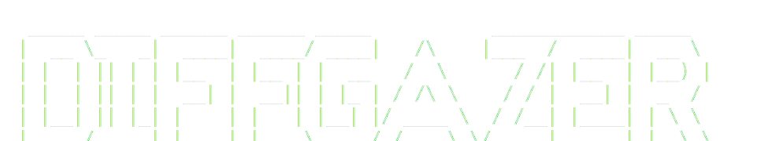
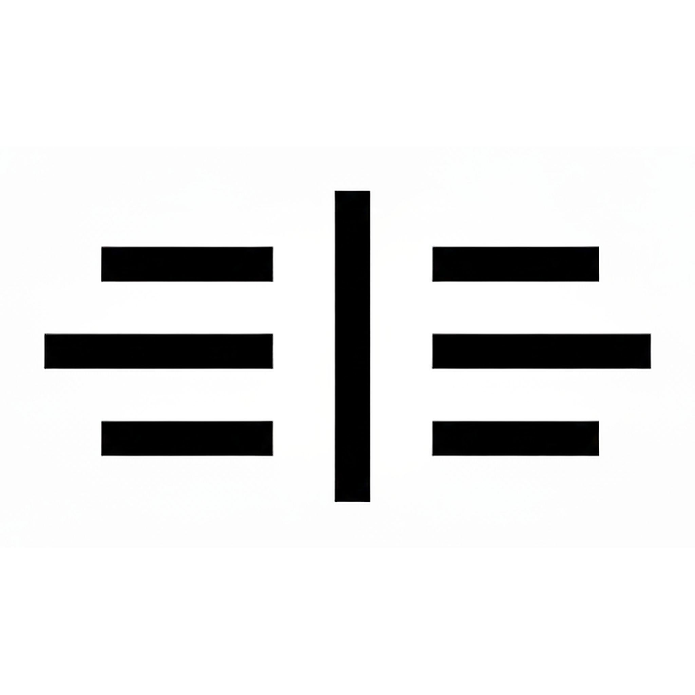

<p align="center">
  
</p>

<p align="center">
  
</p>

Local AI code review. Run one command, get a review from AI agents, and keep the app on your machine.


## Why

I wanted my own code reviewer. Tools like Claude Code and Codex are great for writing code, but burning tokens on review when you could spend them building felt wrong.

Code review matters, especially now that we're all shipping AI-generated code faster than we can read it. Solo devs rarely get their code reviewed. Privacy, fear of judgment, or just nobody around. Diffgazer is my answer to that.

Run one command, get a review. Only the diff and prompt content go to the provider you choose.

## Features

- **Local-first review** - the CLI starts an embedded server and web UI on localhost.
- **Review pipeline** - diff, context, review, enrich, and report steps run in order.
- **Web and terminal modes** - use the browser UI by default, or the Ink terminal UI when you want to stay in the shell.
- **Issue drilldowns** - read findings inline against your diff and dig into details.
- **Provider choice** - Gemini, Z.ai, Z.ai Coding Plan, OpenRouter, Groq, and Cerebras.
- **Privacy controls** - localhost binding, host allowlist, CSRF protection, per-run token, and explicit repo trust.
- **Registry and packages** - `@diffgazer/ui`, `@diffgazer/keys`, and `dgadd` support copy-first and package consumption paths.

## Quick Start

```bash
npm install -g diffgazer
cd your-project
diffgazer
```

First run walks you through provider setup, credentials storage, model selection, and repo trust.

Diffgazer is also a pnpm monorepo for the CLI, docs app, shared registry tooling, keyboard hooks, and UI packages.

## Workspace

- `cli/diffgazer` - public `diffgazer` CLI
- `cli/add` - public `@diffgazer/add` installer, binary `dgadd`
- `cli/server` - private `@diffgazer/server` embedded Hono backend
- `libs/core` - private `@diffgazer/core` shared schemas and utilities
- `libs/ui` - public `@diffgazer/ui` package
- `libs/keys` - public `@diffgazer/keys` package
- `libs/registry` - private `@diffgazer/registry` workspace library
- `apps/docs` - documentation app
- `apps/web` - private `@diffgazer/web` product frontend
- `apps/landing` - private `@diffgazer/landing` landing page

## Source Setup

```bash
git clone https://github.com/b4r7x/diffgazer.git
cd diffgazer
pnpm install
pnpm run build
```

## Development

```bash
pnpm run docs:dev
pnpm run web:dev
pnpm run diffgazer:dev
pnpm run type-check
pnpm run test
pnpm run verify
```

This repository is one workspace with a single root install and lockfile.

## Consumption Paths

`@diffgazer/ui` and `@diffgazer/keys` support three consumption paths. All npm package names are publish-gated: public npm commands are valid only after `npm view` returns versions. Local tarballs are the package-mode validation path before publication.

| Path | @diffgazer/ui | @diffgazer/keys |
|------|---------------|-----------------|
| Manual copy / shadcn | All components, hooks, libs | Standalone hooks only |
| `dgadd` CLI | All components, hooks, libs | Standalone hooks only |
| npm package | All exports | All exports (including provider-backed APIs) |

### Copy-first mode (`dgadd`)

```bash
pnpm exec dgadd init
pnpm exec dgadd add ui/button keys/navigation
```

Copy mode installs source files the consuming app owns. UI components require Tailwind CSS v4 and the copied `src/styles/styles.css`. Keys standalone hooks require no CSS setup. After `@diffgazer/add` is published, use `npx @diffgazer/add` instead of `pnpm exec dgadd`.

### Runtime package mode

```bash
npm install @diffgazer/ui @diffgazer/keys
```

Package consumers import Tailwind CSS v4, `@diffgazer/ui/sources.css`, and `@diffgazer/ui/styles.css`. `@diffgazer/keys` is a required peer of `@diffgazer/ui` in package mode. Keys provider-backed APIs (`KeyboardProvider`, `useKey`, `useScope`, `useFocusZone`, `useScopedNavigation`) are package-only.

### Direct shadcn / manual copy (future, after publication)

The hosted registry at `https://r.b4r7.dev` is not yet live. After publication (see [PACKAGE_GOVERNANCE.md](./PACKAGE_GOVERNANCE.md#hosted-registry-status)), these commands will be:

```bash
npx shadcn add https://r.b4r7.dev/r/ui/button.json
npx shadcn add https://r.b4r7.dev/r/keys/navigation.json
```

Until then, use `pnpm exec dgadd add ui/button keys/navigation` or `npm install` against locally packed tarballs.

Versioning, release gates, migration expectations, and artifact ownership are documented in [PACKAGE_GOVERNANCE.md](./PACKAGE_GOVERNANCE.md).

## Published-Mode Smoke Test

Packs local workspace packages into isolated temp projects and verifies public imports/bins. This does not install from the public npm registry.

```bash
pnpm run smoke:packages
```

## Package Governance

See [PACKAGE_GOVERNANCE.md](./PACKAGE_GOVERNANCE.md) for:

- Versioning policy and semantic versioning guidelines
- Release process and gates
- Dependency management and lockfile strategy
- Supported consumption contracts for each package
- Breaking change policy
